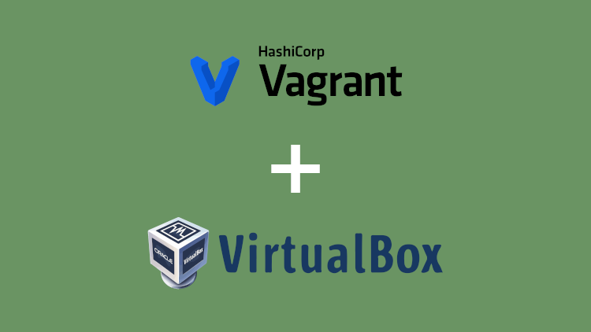
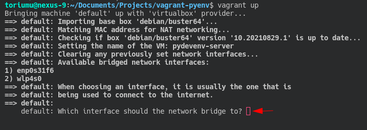
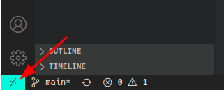
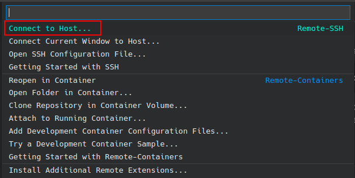
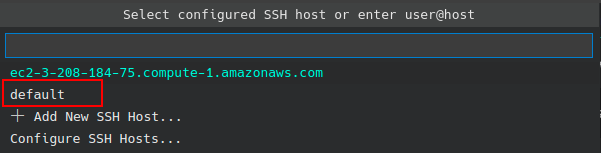
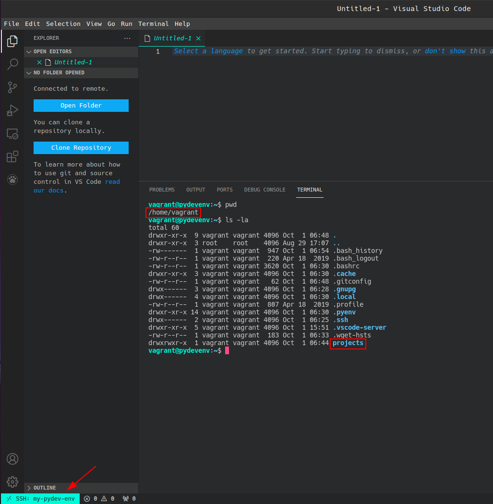
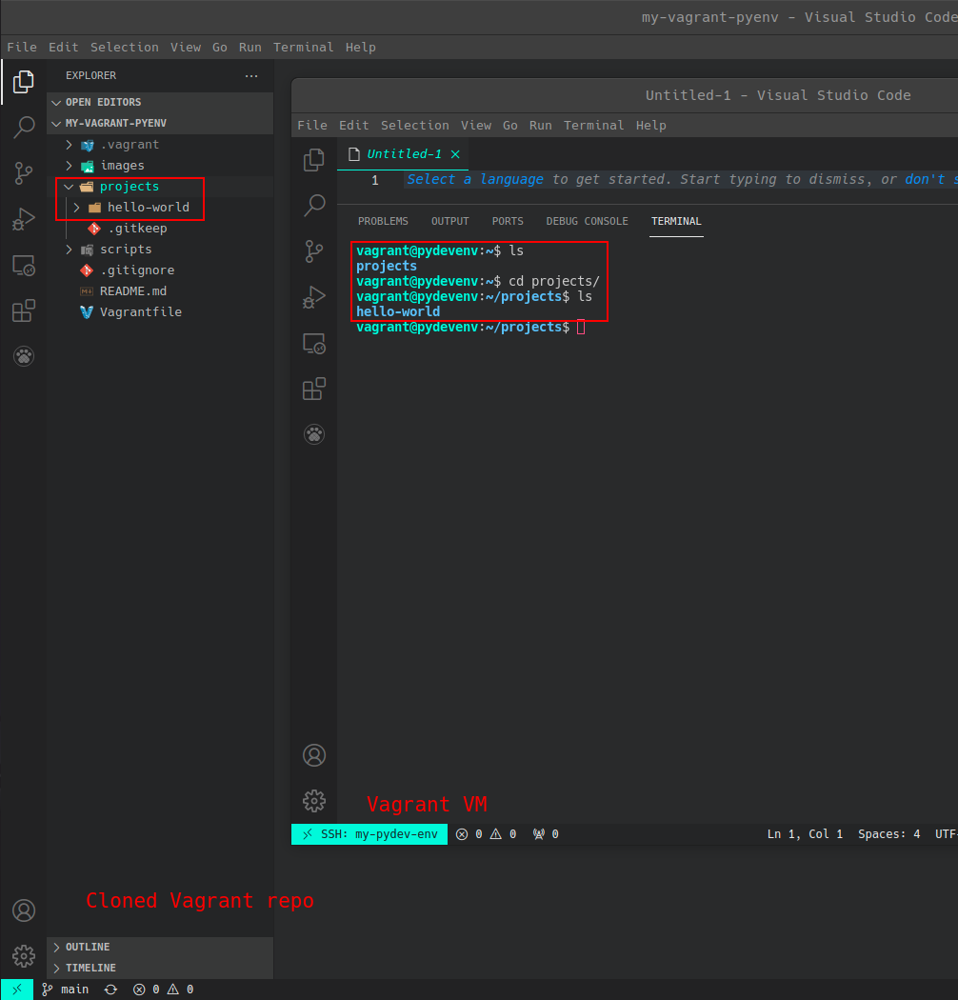
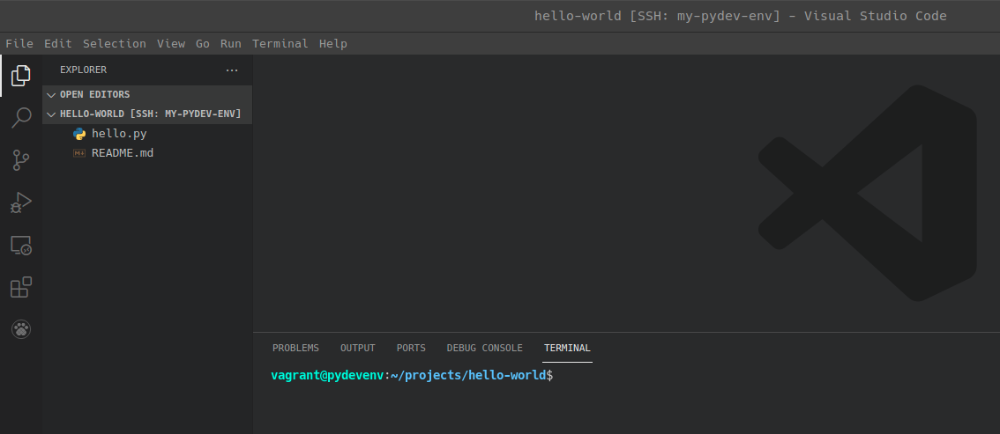

# Vagrant "debian/buster64" Box Provisioned for Python Development Environment



## Description

Use [*Vagrant*](https://www.vagrantup.com/ "Vagrant") to configure a Debian OS virtual environment with *Oracle VirtualBox* as the provider. Shell script provisioning installs [`pyenv`](https://github.com/pyenv/pyenv "pyenv") on the VM to manage mutilpe Python versions and create virtual environments with per-project versions of Python.

## Installation

From a terminal window, clone the repository to your local system:

```bash
git clone https://github.com/erick-marin/vagrant-pyenv.git my-vagrant-pyenv
```

## Usage

Run the *vagrantfile*:

```shell
cd my-vagrant-pyenv
vagrant up
```

If *Vagrant* detects more than one network interface installed on host machine, the command line will request, *"Which interface should the network bridge to?"* as an input. Select the interface to use with guest VM:



The *vagrantfile* will implement box configuration along with accompanying provisioning scripts. This might take a few minutes. Once complete, you can connect to the VM with `ssh`:

```shell
vagrant ssh
```

## Remote Development with Visual Studio Code

If you are using [*Microsoft Visual Studio Code*](https://code.visualstudio.com/ "Microsoft Visual Studio Code") as your editor, take advantage of the IDE's features with the virtual Python environments you create. Install the [Remote Development](https://marketplace.visualstudio.com/items?itemName=ms-VSCode-remote.vscode-remote-extensionpack) extension from Microsoft.  Once the extension is installed, open your cloned Vagrant project folder.

Before executing the following command, make sure the VM is running and disconnected from any `vagrant ssh` connection sessions. Run the following command to view the *SSH* `config` file for the *Vagrant* VM:

```shell
vagrant up
vagrant ssh-config
```

You will receive the following ouput:

```shell
Host default
  HostName 127.0.0.1
  User vagrant
  Port 2222
  UserKnownHostsFile /dev/null
  StrictHostKeyChecking no
  PasswordAuthentication no
  IdentityFile /home/[username]/Documents/Projects/python-test-dev-env/.vagrant/machines/default/virtualbox/private_key
  IdentitiesOnly yes
  LogLevel FATAL
```

Execute the following command to copy the Vagrant box's SSH `config` to your local profile's SSH `config` file:

```shell
vagrant ssh-config >> ~/.ssh/config
```

To "*Open a Remote Window*", *click* on the icon displayed on the lower-left of the *MS Code* application window:



The command palette at the top of the applciation window will drop-down a list of options. *Click* on "*Connect to Host...*":



The command palette then indicates to "Select configured SSH Host" where you will select the VM remote machine you set in SSH `config` file:



This will open a new *MS Code* application window attempting to connect through remote SSH extension.  When a successful connection is made, at the lower left of the application window, it will indicate connection status.  You will also be logged in to the *vagrant* user profile folder. Within the profile folder is a "*projects*" folder created when the Vagrant VM was generated.



This remote folder is synced to the local host "*project*" folder in the cloned Vagrant repo. From within the remote "*projects*" folder, create individual Python project folders using `pyenv` to manage virtual environments and Python versions for each environment.



From the remote *MS Code* application window, create a new directory using the built-in terminal.  Then open the folder with *MS Code".  Initialize as Git repository and begin building your project.



Since the *MS Code* extensions that are installed in your host machine may not have been introduced on the remote side, customize and install the necessary extensions needed for your remote *VS Code* session.

If you decide to delete the Vagrant VM you generated,  all the contents within the synced folder will be saved locally.  Generate the Vagrant VM again and the local folder will sync to VM's folder.

## Using `pyenv` to manage a Python project's virtual environment

`pyenv` is a wonderful tool for managing multiple Python versions. Even if you already have Python installed on your system, it is worth having pyenv installed so that you can easily try out new language features or help contribute to a project that is on a different version of Python.

### Using `pyenv` to  Install Python

If you want to see all the Python versions `pyenv` can install, you can do the following:

```shell
$ pyenv install --list
...
# There are a lot
```

Once you find the Python version(s) you want, you can install it with a single command:

```shell
cd /home/vagrant
pyenv install -v 3.7.12
pyenv install -v 3.8.12
```

The `global` command sets the global Python version. This can be overridden with other commands, but is useful for ensuring you use a particular Python version by default. If you wanted to use version 3.8.12 by default, then you could run this:

```shell
pyenv global 3.7.12
```

Use the following references to learn more about using `pyenv` to switch between multiple versions of Python on your virtual environments:

- [Simple Python Version Management: pyenv](https://github.com/pyenv/pyenv "pyenv")
- [Managing Multiple Python Versions With pyenv](https://realpython.com/intro-to-pyenv/#specifying-your-python-version)

## Contributing

Pull requests are welcome. For major changes, please open an issue first to discuss what you would like to change.

Please make sure to update tests as appropriate.

## License

[MIT](https://choosealicense.com/licenses/mit/)
